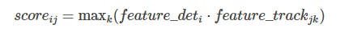
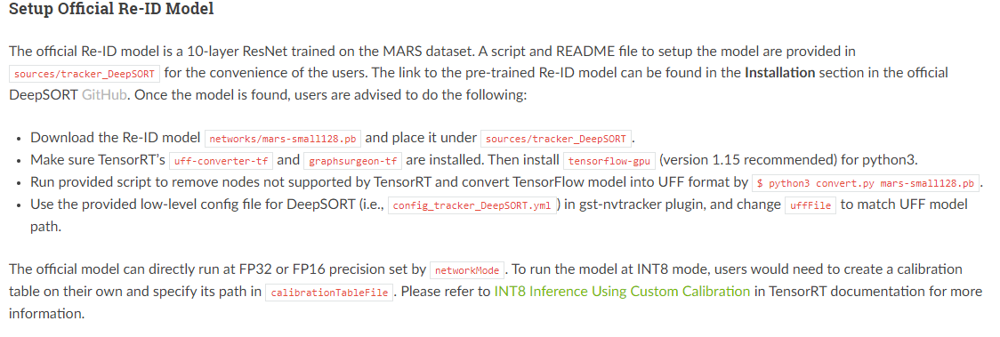
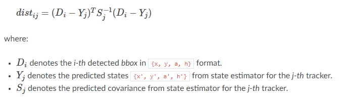
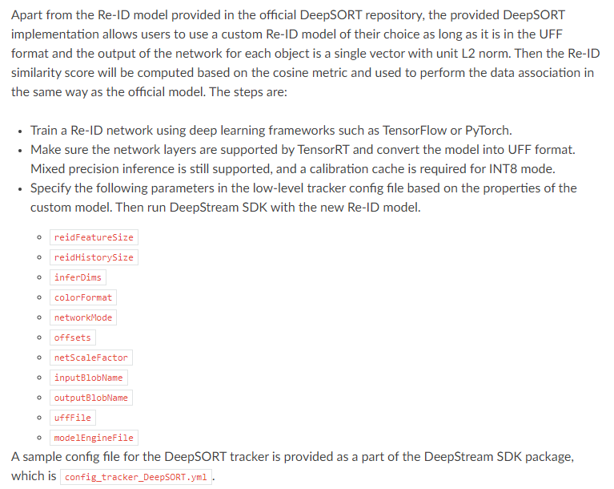
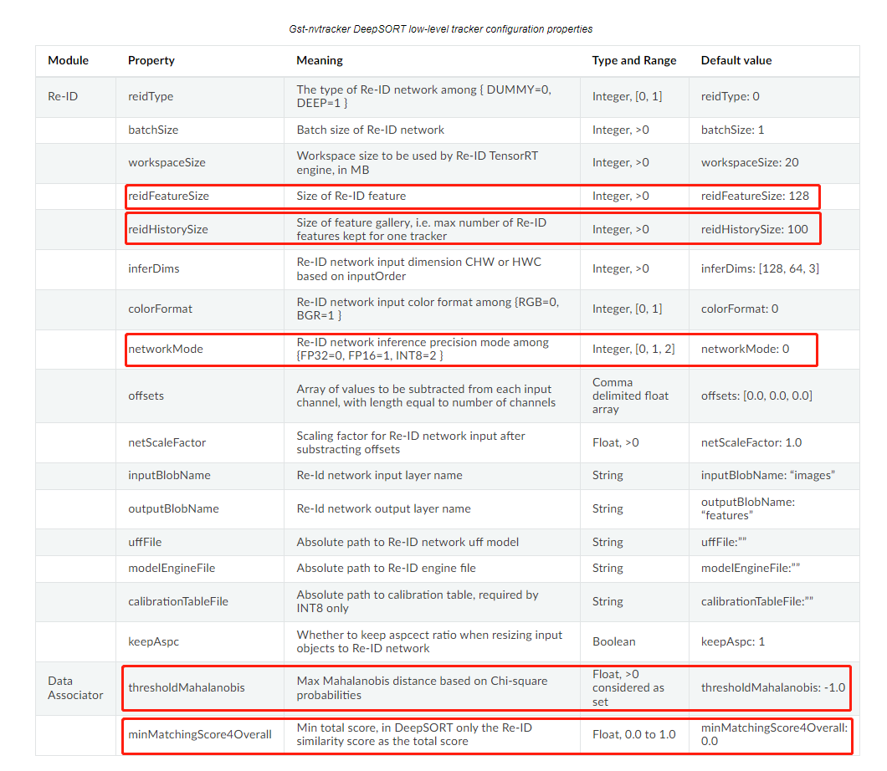
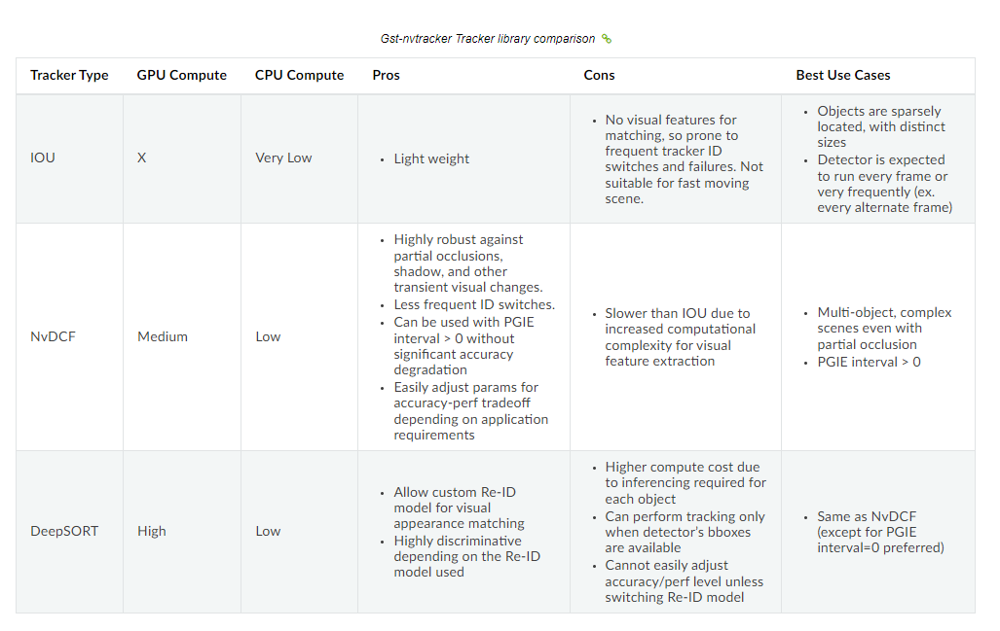

# [DeepStream Tracker](https://docs.nvidia.com/metropolis/deepstream/dev-guide/text/DS_plugin_gst-nvtracker.html#deepsort-tracker-alpha)

The DeepSORT tracker utilizes deep learning based object appearance information for accurate object matching in different frames and locations, resulting in enhanced robustness over occlusions and reduced ID switches. It applies a pre-trained Re-ID (re-identification) neural network to extract a feature vector for each object, compares the similarity between different objects using the extracted feature vector with a cosine distance metric, and combines it with a state estimator to perform the data association over frames. Users can follow instructions in Setup Official Re-ID Model for a quick hands-on. Check Customize Re-ID Model for more information on working with a custom Re-ID model for object tracking with different architectures and datasets.

DeepSORT跟踪器利用基于深度学习的`对象外观信息`对`不同帧`和`不同位置`进行精确的`对象匹配`，从而增强了遮挡的鲁棒性，减少了ID切换。该算法利用预训练的Re-ID (re-identification)神经网络`提取每个目标的特征向量`，利用提取的`特征向量的余弦距离`度量比较不同目标之间的相似度，并将其与状态估计器结合进行帧间的数据关联。用户可以按照安装官方重新id模型的说明进行快速操作。 查看Customize Re-ID Model，了解更多关于使用定制的Re-ID模型进行不同架构和数据集的对象跟踪的信息。  

## [Re-ID](https://docs.nvidia.com/metropolis/deepstream/dev-guide/text/DS_plugin_gst-nvtracker.html#re-id)

对于Re-ID，作为输入提供的检测器对象首先会根据所使用的Re-ID模型的输入大小进行裁剪和调整。 参数keepAspc控制裁剪后是否保留对象的长宽比。 然后使用预训练的卷积神经网络模型对目标进行批量处理，并对每个检测器对象输出L2范数等于1的定维向量作为Re-ID特征。 NVIDIA TensorRT™用于从网络中生成一个引擎来进行Re-ID推断。 对于每个目标跟踪器，其最新的Re-ID特征画廊保存在内部。 图库的大小可以由reidHistorySize设置。  

### [Re-ID Similarity Score](https://docs.nvidia.com/metropolis/deepstream/dev-guide/text/DS_plugin_gst-nvtracker.html#re-id-similarity-score)

对于每个检测器对象和每个目标，使用其向量之间的余弦距离（[0, 1]之间]）作为Re-ID相似度得分。   
具体来说，计算检测器检测到的对象（检测框）的Re-ID特征与跟踪器图库中的每个Re-ID特征之间的点积。 其中，将所有点积的最大值确定为相似度得分。 第i个检测器对象与第j个目标之间的得分为：  

  

只有当score大于 `minMatchingScore40overall` 时检测框和目标才能匹配上。 

### [Setup Official Re-ID Model]([imgs/DeepStream_Tracker/2-setup.png](https://docs.nvidia.com/metropolis/deepstream/dev-guide/text/DS_plugin_gst-nvtracker.html#setup-official-re-id-model))  

   

### [Data Association](https://docs.nvidia.com/metropolis/deepstream/dev-guide/text/DS_plugin_gst-nvtracker.html#setup-official-re-id-model)

通常通过两个指标衡量DeepSORT跟踪器数据关联的性能：  

- Proximity 接近度  
    在接近度评分中，主要计算目标与检测器检测框之间的马氏距离。具体来说，第i个探测器目标与第j个目标的马氏距离计算如下:  

      

    根据官方的DeepSORT，通过卡方倒数分布计算得到马氏距离的阈值为95%的置信区间。 这意味着任何被检测的目标和要匹配的跟踪器的最大马氏距离都大于9.4877。 该阈值由 `thresholdMahalanobis` 设置。  

- Re-ID based visual similarity 基于Re-ID的视觉相似度  

    该得分根据检测器目标特征向量与Re-ID目标特征向量之间的余弦距离计算。  
    
对于每个目标，使用这两个度量来识别和过滤一组候选检测器对象，以最小化匹配过程的计算成本。 给定每个目标的识别候选集，基于Re-ID相似度分数，可以使用贪婪算法来寻找最佳匹配。  

### [Customize Re-ID Model](https://docs.nvidia.com/metropolis/deepstream/dev-guide/text/DS_plugin_gst-nvtracker.html#customize-re-id-model)

   

### [Configuration Parameters](https://docs.nvidia.com/metropolis/deepstream/dev-guide/text/DS_plugin_gst-nvtracker.html#id5)

以下表格总结了DeepSORT low-level跟踪器的可配置参数：  

   

## [Low-Level Tracker Comparisons and Tradeoffs](https://docs.nvidia.com/metropolis/deepstream/dev-guide/text/DS_plugin_gst-nvtracker.html#low-level-tracker-comparisons-and-tradeoffs)

DeepStream SDK提供了三个low-level跟踪器库，它们在准确性、健壮性和效率方面具有不同的资源需求和性能特征，允许用户根据自己的用例和需求选择最佳的跟踪器。见下表比较:  

   

