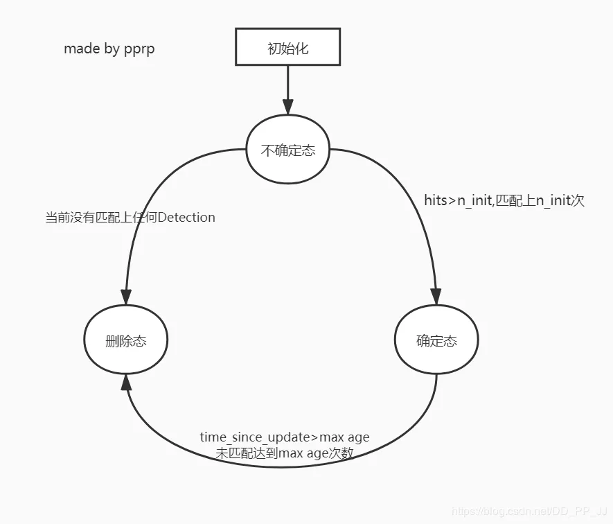
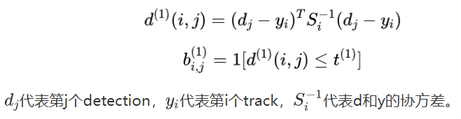
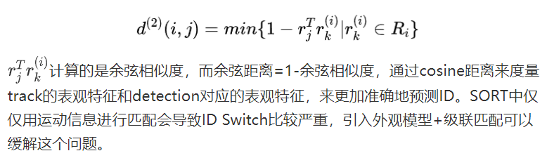
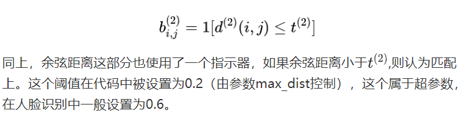
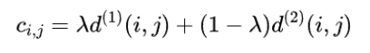
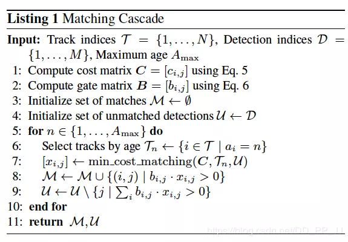
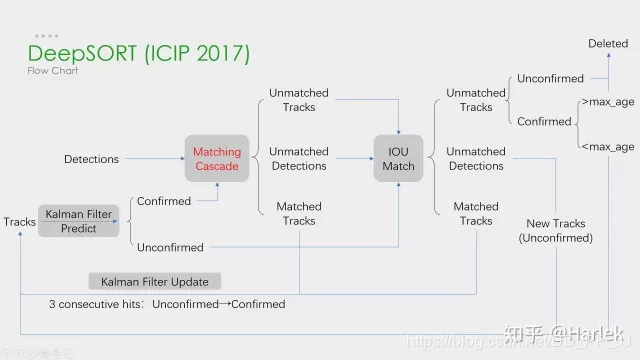

# Deep SORT总结

## 简介

Simple Online and Realtime Tracking(SORT)，是一个简单有效的多目标跟踪算法。仅仅通过 IOU 来进行匹配 → 速度极快，同时存在 ID switch 问题。

Deep SORT 通过**_集成表观_**信息来提升 SORT 的性能表现，能更好地处理目标被长时间遮挡的情况，将 ID Switch 问题减少 45%。论文中通过在大型行人重识别数据集上训练得到的深度关联度量来提取表观特征。

## 方法

### 状态估计

延续 SORT 算法使用 8 维的状态空间，其中(u, v)代表 bbox 的中心点，r 代表宽高比，h 代表高以及对应的在图像坐标上的相对速度。  
每一个轨迹，都计算当前帧距上次匹配成功帧的差值，代码中对应 time_since_update 变量。该变量在卡尔曼滤波器 predict 的时候递增，在轨迹和 detection 关联的时候重置为 0。  
超过最大年龄的轨迹被认为离开图片区域，将从轨迹集合中删除，被设置为删除状态。代码中最大年龄默认值为 70，是级联匹配中的循环次数。  
如果 detection 没有和现有 track 匹配上的，那么将对这个 detection 进行初始化，转变为新的 Track。新的 Track 初始化的时候的状态是未确定态，只有满足连续三帧都成功匹配，才能将未确定态转化为确定态。  
如果处于未确定态的 Track 没有在 n_init 帧中匹配上 detection，将变为删除态，从轨迹集合中删除。


### 匹配问题

Assignment Problem 在这里主要是匹配估计 Track 和观测结果 Detection，常用匈牙利算法（或者 KM 算法）来解决。该算法求解对象是一个代价矩阵：

- 使用**平方马氏距离**（协方差距离）来度量 Track 和 Detection 之间的距离：  
  
  第二个公式是一个指示器，比较的是马氏距离和卡方分布的阈值，=9.4877，如果马氏距离小于该阈值，代表成功匹配。
- 使用 cosine 距离来度量表观特征之间的距离，reid 模型抽出得到一个 128 维的向量，使用余弦距离来进行比对：
    
   通过 cosine 距离来度量 track 的表观特征和 detection 对应的表观特征，来更加准确地预测 ID。SORT 中仅仅用运动信息进行匹配会导致 ID Switch 比较严重，引入外观模型+级联匹配可以缓解这个问题。
  
- 综合匹配通过运动模型和外观模型的加权得到：
  

### 级联匹配

**_级联匹配是 Deep SORT 区别于 SORT 的一个核心算法，致力于解决目标长时间被遮挡的情况。_**为了让当前 detection 匹配到当前时刻最近的 track，匹配的时候 detection 优先匹配消失时间较短的 track。  
_目标长时间被遮挡带来的问题_：卡尔曼滤波预测结果将增加非常大的不确定性（因为在被遮挡这段时间没有观测对象来调整），状态空间内的可观察性就会大大降低。
_SORT 中 ID switch 现象多的原因_：在两个 track 竞争同一个 detection 时，消失时间更长的 track 往往匹配得到的协方差距离更小，使得 detection 更可能和遮挡时间较长的 track 相关联。

级联匹配：



伪代码中需要注意的是匹配顺序，优先匹配 age 比较小的轨迹，对应实现如下：

```python
# 1. 分配track_indices和detection_indices
if track_indices is None:
    track_indices = list(range(len(tracks)))

if detection_indices is None:
    detection_indices = list(range(len(detections)))

unmatched_detections = detection_indices

matches = []
# cascade depth = max age 默认为70
for level in range(cascade_depth):
    if len(unmatched_detections) == 0:  # No detections left
        break

    track_indices_l = [
        k for k in track_indices
        if tracks[k].time_since_update == 1 + level
    ]
    if len(track_indices_l) == 0:  # Nothing to match at this level
        continue

    # 2. 级联匹配核心内容就是这个函数
    matches_l, _, unmatched_detections = \
        min_cost_matching(  # max_distance=0.2
            distance_metric, max_distance, tracks, detections,
            track_indices_l, unmatched_detections)
    matches += matches_l
unmatched_tracks = list(set(track_indices) - set(k for k, _ in matches))
return matches, unmatched_tracks, unmatched_detections
```

在匹配的最后阶段还对 unconfirmed 和 age=1 的未匹配轨迹进行基于 IOU 的匹配(和 SORT 一致)。这可以**缓解因为表观突变或者部分遮挡导致的较大变化**。



### 表观特征

## 总结

Deep SORT 可以看成三部分：

- 检测: 目标检测的效果对结果影响非常非常大, 并且 Recall 和 Precision 都应该很高才可以满足要求。
- 表观特征
- 关联：卡尔曼滤波算法和匈牙利算法。

## 参考

[论文地址](https://arxiv.org/pdf/1703.07402.pdf)  
[代码地址](https://github.com/nwojke/deep_SORT)  
[博客](https://www.cnblogs.com/YiXiaoZhou/p/7074037.html)
