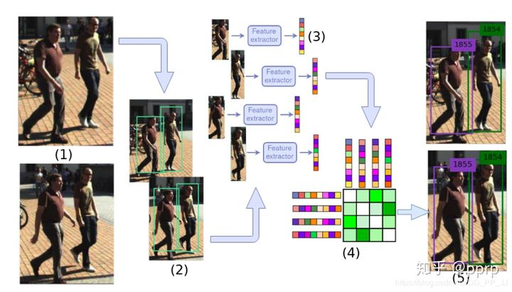
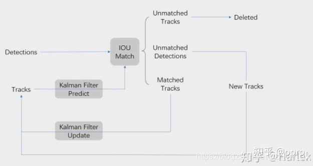
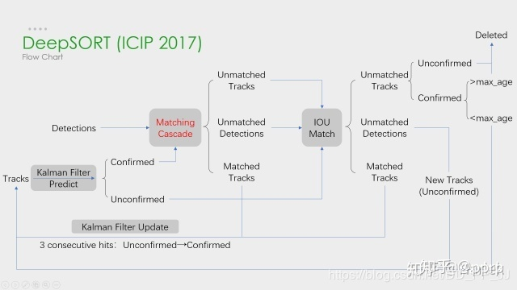
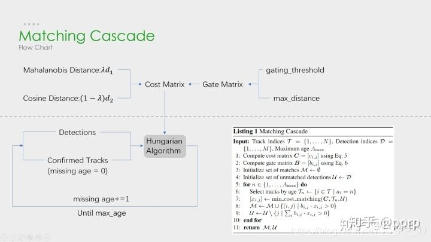
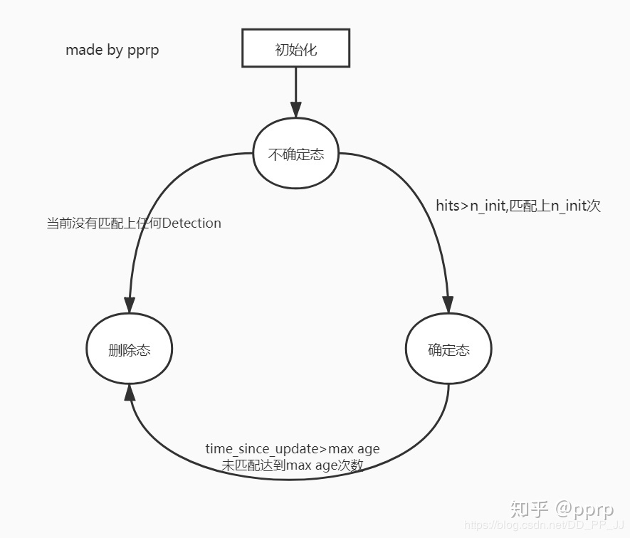

# Deep SORT 算法代码解析

***Detection Based Tracking***

## MOT 主要步骤

在《DEEP LEARNING IN VIDEO MULTI-OBJECT TRACKING: A SURVEY》这篇基于深度学习的多目标跟踪的综述中，描述了MOT问题中四个主要步骤： 

  

- 给定视频原始帧
- 运行目标检测器进行检测，获取目标检测框
- 将所有目标框中的目标抠出来，进行特征提取（包括表观特征和运动特征）并进行相似度计算，计算前后两帧目标间的匹配程度
- 数据关联，为每个对象分配目标的id

***核心是检测***  

## SORT

Deep SORT算法的前身是SORT, 全称是Simple Online and Realtime Tracking。最大特点是基于Faster R-CNN目标检测方法，利用卡尔曼滤波算法 + 匈牙利算法，极大提高了多目标跟踪速度，同时达到SOTA的准确率。

### 卡尔曼滤波算法

主要分为两个过程：预测和更新。该算法将目标的运动状态定义为8个正态分布的向量：  

预测：当目标发生移动，通过上一帧的目标框和速度等参数，预测出当前帧目标框位置和速度等参数。  

更新：通过*预测值*和*观测值*两个正态分布的状态进行线性加权得到目前系统预测的状态。

### 匈牙利算法

解决的是分配问题，在MOT主要步骤计算相似度中，得到前后两帧的相似度矩阵。匈牙利算法就是通过求解这个相似度矩阵，解决前后两帧匹配的问题。这部分sklearn库有对应的函数linear_assignment来进行求解。  

SORT算法中是通过前后两帧IOU来构建相似度矩阵的，所以SORT计算速度非常快，算法流程图：  

  

Detections是通过目标检测器得到的目标框，Tracks是一段轨迹。核心是匹配的过程与卡尔曼滤波的预测和更新过程。

流程如下：目标检测器得到的目标框Detections，同时卡尔曼滤波器预测当前帧的Tracks，然后将Detections和Tracks进行IOU匹配，结果分为：

- Unmatched Tracks，IOU小于阈值，当失配持续T次时，该目标ID将从图片中删去
- Unmatched Detections， 没有任意一个Tracks能匹配该Detection，所以要为该Detection分配一个新的track
- Matched Tracks，得到匹配

卡尔曼滤波预测：能根据Tracks状态预测下一帧的目标框状态。  
卡尔曼滤波更新：对观测值（匹配上的Track）和估计值更新所有track的状态。

## Deep SORT

Deep SORT的最大特点是加入外观信息，借用ReID领域模型来提取特征，减少ID switch的次数。流程图如下：  

  

可以看出，Deep SORT算法在SORT算法的基础上增加了**级联匹配(Matching Cascade)** + **新轨迹的确认(confirmed)**。总体流程就是：  
- 卡尔曼滤波器预测轨迹Tracks
- 使用匈牙利算法将预测得到的轨迹Tracks和当前帧中的detections进行匹配(级联匹配和IOU匹配)
- 卡尔曼滤波更新。

级联匹配：

  

由虚线划分为两部分：  
上半部分中，从左到右：马氏距离（运动模型）和余弦距离（外观模型-目标向量）来计算相似度得到代价矩阵。同时门控矩阵用于限制代价矩阵中过大的值。  

下半部分是级联匹配的数据关联过程，匹配是一个max age个迭代过程，从missing age=0到missing age=70的轨迹和Detections进行匹配，没有丢失过的轨迹优先匹配，丢失较为久远的就靠后匹配。通过这部分处理，可以重新将被遮挡目标找回，降低被遮挡然后再出现的目标发生的ID Switch次数。  

**Detection** 和 **Track** 进行匹配过程中出现的情况：

- Detection 和 Track匹配，即 Matched Tracks：前后两帧都有该目标，轨迹和目标匹配上；
- Detection没有找到匹配的Track，即 Unmatched Detections。图像中突然出现新的目标时，Detection无法在之前的Track上找到蒲培的目标
- Track没有找到匹配的Detection，即 Unmatched Tracks。连续追踪的目标超出图像区域，Track无法与当前任意一个Detection匹配
- 以上没有涉及一种特殊的情况，就是两个目标遮挡的情况。刚刚被遮挡的目标的Track也无法匹配Detection，目标暂时从图像中消失。之后被遮挡目标再次出现的时候，应该尽量让被遮挡目标分配的ID不发生变动，减少ID Switch出现的次数，这就需要用到级联匹配了。

## Deep SORT代码解析

[代码地址](https://link.zhihu.com/?target=https%3A//github.com/nwojke/deep_sort)  

### 类图

  

DeepSort是核心类，调用其他模块，大体上可以分为三个模块：

- ReID模块：用于提取表观特征，原论文是生成了128维的embedding；
- Track模块：轨迹类，用于保存Track的状态信息；
- Tracker模块：调用该模块实现卡尔曼滤波和匈牙利算法。

DeepSort类对外接口：  

```python
self.deepsort = DeepSort(args.deepsort_checkpoint)  # 实例化
outputs = self.deepsort.update(bbox_xcycwh, cls_conf, im)  # 通过接收目标框来进行更新
```

#### Detection类

```python
class Detection(object):
    """
    This class represents a bounding box detection in a single image.
 """
    def __init__(self, tlwh, confidence, feature):
        self.tlwh = np.asarray(tlwh, dtype=np.float)
        self.confidence = float(confidence)
        self.feature = np.asarray(feature, dtype=np.float32)
    def to_tlbr(self):
        """Convert bounding box to format `(min x, min y, max x, max y)`, i.e.,
        `(top left, bottom right)`.
        """
        ret = self.tlwh.copy()
        ret[2:] += ret[:2]
        return ret
    def to_xyah(self):
        """Convert bounding box to format `(center x, center y, aspect ratio,
        height)`, where the aspect ratio is `width / height`.
        """
        ret = self.tlwh.copy()
        ret[:2] += ret[2:] / 2
        ret[2] /= ret[3]
        return ret
```

Detection类用于保存通过目标检测器得到的一个检测框，包含top left坐标+框的宽和高(tlwh)，以及该bbox的置信度(confidence)还有通过reid获取得到的对应的embedding(feature)。除此以外提供了不同bbox位置格式的转换方法：

- tlwh: 代表左上角坐标+宽高
- tlbr: 代表左上角坐标+右下角坐标
- xyah: 代表中心坐标+宽高比+高  
  
#### Track类

```python
class Track:
    # 轨迹的信息包含：(x,y,a,h) & v
    """
    A single target track with state space `(x, y, a, h)` and associated
    velocities, where `(x, y)` is the center of the bounding box, `a` is the
    aspect ratio and `h` is the height.
    """

    def __init__(self, mean, covariance, track_id, n_init, max_age,
                 feature=None):
        # max age是一个存活期限，默认为70帧,在
        self.mean = mean  # 框的位置
        self.covariance = covariance  # 框的速度信息
        self.track_id = track_id
        self.hits = 1 
        # hits和n_init进行比较
        # hits每次update的时候进行一次更新（只有match的时候才进行update）
        # hits代表匹配上了多少次，匹配次数超过n_init就会设置为confirmed状态
        self.age = 1 # 没有用到，和time_since_update功能重复
        self.time_since_update = 0
        # 每次调用predict函数的时候就会+1
        # 每次调用update函数的时候就会设置为0

        self.state = TrackState.Tentative # 框的状态
        self.features = []
        # 每个track对应多个features, 每次更新都将最新的feature添加到列表中
        if feature is not None:
            self.features.append(feature)

        self._n_init = n_init  # 如果连续n_init帧都没有出现失配，设置为deleted状态
        self._max_age = max_age  # 上限
```

目标检测框的状态state有三种：  
- Tentative：不确定态，这种状态会在初始化一个Track的时候进行分配，并且只有在连续匹配上n_init帧后才会转变为确定态。如果在处于不确定态的情况下没有匹配上任何detection，那将转变为删除态；
- Confirmed：确定态，代表Track处于匹配状态。如果当前Track处于确定态，但是失配连续达到max age次数时，就会转变为删除态；
- Deleted：删除态，代表该Track已经失效。

  

变量：
- max_age：代表Track的存活期限，用于从确定态转为删除态。time_since_update在track每次调用predict函数时+1，调用update函数时置为0。也就是说***当一个轨迹长时间没有update（没有匹配上）的时候，time_since_update不断增加，超过max age时，
- 将这个track从Tracker列表中删除（deleted状态）***
- hits：代表连续确认（匹配）多少次，用于从不确定态转为确定态。每次Track进行update时，hits++，如果hits > n_init（默认是3），也就是连续三帧的该轨迹都得到了匹配，这时候才将不确定态转为确定态。
- features列表，存储轨迹在不同帧对应位置通过ReID提取到的特征。`为何要保存这个列表，而不是更新为当前最新的特征呢？`这是为了解决目标被遮挡后再次出现的问题，需要从features列表中进行特征匹配。但如果features列表保存特征过多，又会严重拖慢计算速度，所以用budget参数控制features列表的长度，只取最新的budget个features，将旧的删掉。


#### ReID特征提取部分

ReID网络是独立于目标检测和跟踪器的模块，功能是提取对应bounding box中的feature，得到一个固定维度的embedding作为该bbox的代表，供匹配时计算相似度使用。  

```python
class Extractor(object):
    def __init__(self, model_name, model_path, use_cuda=True):
        self.net = build_model(name=model_name,
                               num_classes=96)
        self.device = "cuda" if torch.cuda.is_available(
        ) and use_cuda else "cpu"
        state_dict = torch.load(model_path)['net_dict']
        self.net.load_state_dict(state_dict)
        print("Loading weights from {}... Done!".format(model_path))
        self.net.to(self.device)
        self.size = (128,128)
        self.norm = transforms.Compose([
            transforms.ToTensor(),
            transforms.Normalize([0.3568, 0.3141, 0.2781],
                                 [0.1752, 0.1857, 0.1879])
        ])

    def _preprocess(self, im_crops):
        """
        TODO:
            1. to float with scale from 0 to 1
            2. resize to (64, 128) as Market1501 dataset did
            3. concatenate to a numpy array
            3. to torch Tensor
            4. normalize
        """
        def _resize(im, size):
            return cv2.resize(im.astype(np.float32) / 255., size)

        im_batch = torch.cat([
            self.norm(_resize(im, self.size)).unsqueeze(0) for im in im_crops
        ],dim=0).float()
        return im_batch

    def __call__(self, im_crops):
        im_batch = self._preprocess(im_crops)
        with torch.no_grad():
            im_batch = im_batch.to(self.device)
            features = self.net(im_batch)
        return features.cpu().numpy()
```

模型训练是按照传统ReID的方法进行，使用Extractor类的时候输入为一个list的图片，得到图片对应的特征。

#### NearestNeighborDistanceMetric类

这个类中用到了两个计算距离的函数：  
- 欧氏距离
  ```python
    def _pdist(a, b):
        # 用于计算成对的平方距离
        # a NxM 代表N个对象，每个对象有M个数值作为embedding进行比较
        # b LxM 代表L个对象，每个对象有M个数值作为embedding进行比较
        # 返回的是NxL的矩阵，比如dist[i][j]代表a[i]和b[j]之间的平方和距离
        # 实现见：https://blog.csdn.net/frankzd/article/details/80251042
        a, b = np.asarray(a), np.asarray(b)  # 拷贝一份数据
        if len(a) == 0 or len(b) == 0:
            return np.zeros((len(a), len(b)))
        # np.sqrt()开方，np.square()平方
        a2, b2 = np.square(a).sum(axis=1), np.square(
            b).sum(axis=1)  # 求每个embedding的平方和
        # sum(N) + sum(L) -2 x [NxM]x[MxL] = [NxL]
        r2 = -2. * np.dot(a, b.T) + a2[:, None] + b2[None, :]
        # np.clip(a, a_min, a_max, out=None) 将数组a中的所有数限定到范围a_min和a_max中。
        r2 = np.clip(r2, 0., float(np.inf))
        return r2
  ```
    


- 余弦距离
    ```python
    def _cosine_distance(a, b, data_is_normalized=False):
        # a和b之间的余弦距离
        # a : [NxM] b : [LxM]
        # 余弦距离 = 1 - 余弦相似度
        # https://blog.csdn.net/u013749540/article/details/51813922
        if not data_is_normalized:
            # 需要将余弦相似度转化成类似欧氏距离的余弦距离。
            a = np.asarray(a) / np.linalg.norm(a, axis=1, keepdims=True)
            #  np.linalg.norm 操作是求向量的范式，默认是L2范式，等同于求向量的欧式距离。
            b = np.asarray(b) / np.linalg.norm(b, axis=1, keepdims=True)
        return 1. - np.dot(a, b.T)
    ```
    

#### 最近邻距离度量类

```python
class NearestNeighborDistanceMetric(object):
    # 对于每个目标，返回一个最近的距离
    def __init__(self, metric, matching_threshold, budget=None):
        # 默认matching_threshold = 0.2 budge = 100
        if metric == "euclidean":
            # 使用最近邻欧氏距离
            self._metric = _nn_euclidean_distance
        elif metric == "cosine":
            # 使用最近邻余弦距离
            self._metric = _nn_cosine_distance
        else:
            raise ValueError("Invalid metric; must be either 'euclidean' or 'cosine'")

        self.matching_threshold = matching_threshold
        # 在级联匹配的函数中调用
        self.budget = budget
        # budge 预算，控制feature的多少
        self.samples = {}
        # samples是一个字典{id->feature list}

    def partial_fit(self, features, targets, active_targets):
        # 作用：部分拟合，用新的数据更新测量距离
        # 调用：在特征集更新模块部分调用，tracker.update()中
        for feature, target in zip(features, targets):
            self.samples.setdefault(target, []).append(feature)
            # 对应目标下添加新的feature，更新feature集合
            # 目标id  :  feature list
            if self.budget is not None:
                self.samples[target] = self.samples[target][-self.budget:]
            # 设置预算，每个类最多多少个目标，超过直接忽略。list[-10:] ： list列表的后十个元素（append进行的最后十个元素）

        # 筛选激活的目标
        self.samples = {k: self.samples[k] for k in active_targets}

    def distance(self, features, targets):
        # 作用：比较feature和targets之间的距离，返回一个代价矩阵
        # 调用：在匹配阶段，将distance封装为gated_metric,
        #       进行外观信息(reid得到的深度特征)+
        #       运动信息(马氏距离用于度量两个分布相似程度)
        cost_matrix = np.zeros((len(targets), len(features)))
        for i, target in enumerate(targets):
            cost_matrix[i, :] = self._metric(self.samples[target], features)
        return cost_matrix
```


#### Tracker类

Tracker类是`最核心`的类，Tracker中`保存了所有的轨迹信息`，负责`初始化第一帧的轨迹`、`卡尔曼滤波的预测和更新`、负责`级联匹配`、`IOU匹配`等等核心工作。  

```python
class Tracker:
    # 是一个多目标tracker，保存了很多个track轨迹
    # 负责调用卡尔曼滤波来预测track的新状态+进行匹配工作+初始化第一帧
    # Tracker调用update或predict的时候，其中的每个track也会各自调用自己的update或predict
    """
    This is the multi-target tracker.
    """

    def __init__(self, metric, max_iou_distance=0.7, max_age=70, n_init=3):
        # 调用的时候，后边的参数全部是默认的
        self.metric = metric 
        # metric是一个类，用于计算距离(余弦距离或马氏距离)
        self.max_iou_distance = max_iou_distance
        # 最大iou，iou匹配的时候使用
        self.max_age = max_age
        # 直接指定级联匹配的cascade_depth参数
        self.n_init = n_init
        # n_init代表需要n_init次数的update才会将track状态设置为confirmed

        self.kf = kalman_filter.KalmanFilter()# 卡尔曼滤波器
        self.tracks = [] # 保存一系列轨迹
        self._next_id = 1 # 下一个分配的轨迹id

    def predict(self):
        # 遍历每个track都进行一次预测
        """Propagate track state distributions one time step forward.

        This function should be called once every time step, before `update`.
        """
        for track in self.tracks:
            track.predict(self.kf)

    def update(self, detections):
        # 进行测量的更新和轨迹管理
        """Perform measurement update and track management.

        Parameters
        ----------
        detections : List[deep_sort.detection.Detection]
            A list of detections at the current time step.

        """
        # Run matching cascade.
        matches, unmatched_tracks, unmatched_detections = \
            self._match(detections)

        # Update track set.
        # 1. 针对匹配上的结果
        for track_idx, detection_idx in matches:
            # track更新对应的detection
            self.tracks[track_idx].update(self.kf, detections[detection_idx])

        # 2. 针对未匹配的tracks,调用mark_missed标记
        # track失配，若待定则删除，若update时间很久也删除
        # max age是一个存活期限，默认为70帧
        for track_idx in unmatched_tracks:
            self.tracks[track_idx].mark_missed()

        # 3. 针对未匹配的detection， detection失配，进行初始化
        for detection_idx in unmatched_detections:
            self._initiate_track(detections[detection_idx])

        # 得到最新的tracks列表，保存的是标记为confirmed和Tentative的track
        self.tracks = [t for t in self.tracks if not t.is_deleted()]

        # Update distance metric.
        active_targets = [t.track_id for t in self.tracks if t.is_confirmed()]
        # 获取所有confirmed状态的track id
        features, targets = [], []
        for track in self.tracks:
            if not track.is_confirmed():
                continue
            features += track.features  # 将tracks列表拼接到features列表
            # 获取每个feature对应的track id
            targets += [track.track_id for _ in track.features]
            track.features = []

        # 距离度量中的 特征集更新
        self.metric.partial_fit(np.asarray(features), np.asarray(targets),
                                active_targets)

    def _match(self, detections):
        # 主要功能是进行匹配，找到匹配的，未匹配的部分
        def gated_metric(tracks, dets, track_indices, detection_indices):
            # 功能： 用于计算track和detection之间的距离，代价函数
            #        需要使用在KM算法之前
            # 调用：
            # cost_matrix = distance_metric(tracks, detections,
            #                  track_indices, detection_indices)
            features = np.array([dets[i].feature for i in detection_indices])
            targets = np.array([tracks[i].track_id for i in track_indices])

            # 1. 通过最近邻计算出代价矩阵 cosine distance
            cost_matrix = self.metric.distance(features, targets)
            # 2. 计算马氏距离,得到新的状态矩阵
            cost_matrix = linear_assignment.gate_cost_matrix(
                self.kf, cost_matrix, tracks, dets, track_indices,
                detection_indices)
            return cost_matrix

        # Split track set into confirmed and unconfirmed tracks.
        # 划分不同轨迹的状态
        confirmed_tracks = [
            i for i, t in enumerate(self.tracks) if t.is_confirmed()
        ]
        unconfirmed_tracks = [
            i for i, t in enumerate(self.tracks) if not t.is_confirmed()
        ]

        # 进行级联匹配，得到匹配的track、不匹配的track、不匹配的detection
        '''
        !!!!!!!!!!!
        级联匹配
        !!!!!!!!!!!
        '''
        # gated_metric->cosine distance
        # 仅仅对确定态的轨迹进行级联匹配
        matches_a, unmatched_tracks_a, unmatched_detections = \
            linear_assignment.matching_cascade(
                gated_metric,
                self.metric.matching_threshold,
                self.max_age,
                self.tracks,
                detections,
                confirmed_tracks)

        # 将所有状态为未确定态的轨迹和刚刚没有匹配上的轨迹组合为iou_track_candidates，
        # 进行IoU的匹配
        iou_track_candidates = unconfirmed_tracks + [
            k for k in unmatched_tracks_a
            if self.tracks[k].time_since_update == 1  # 刚刚没有匹配上
        ]
        # 未匹配
        unmatched_tracks_a = [
            k for k in unmatched_tracks_a
            if self.tracks[k].time_since_update != 1  # 已经很久没有匹配上
        ]

        '''
        !!!!!!!!!!!
        IOU 匹配
        对级联匹配中还没有匹配成功的目标再进行IoU匹配
        !!!!!!!!!!!
        '''
        # 虽然和级联匹配中使用的都是min_cost_matching作为核心，
        # 这里使用的metric是iou cost和以上不同
        matches_b, unmatched_tracks_b, unmatched_detections = \
            linear_assignment.min_cost_matching(
                iou_matching.iou_cost,
                self.max_iou_distance,
                self.tracks,
                detections,
                iou_track_candidates,
                unmatched_detections)

        matches = matches_a + matches_b  # 组合两部分match得到的结果

        unmatched_tracks = list(set(unmatched_tracks_a + unmatched_tracks_b))
        return matches, unmatched_tracks, unmatched_detections
```


级联匹配伪代码：  


实现：  
```python
# 1. 分配track_indices和detection_indices
if track_indices is None:
    track_indices = list(range(len(tracks)))

if detection_indices is None:
    detection_indices = list(range(len(detections)))

unmatched_detections = detection_indices

matches = []
# cascade depth = max age 默认为70
for level in range(cascade_depth):
    if len(unmatched_detections) == 0:  # No detections left
        break

    track_indices_l = [
        k for k in track_indices
        if tracks[k].time_since_update == 1 + level
    ]
    if len(track_indices_l) == 0:  # Nothing to match at this level
        continue

    # 2. 级联匹配核心内容就是这个函数
    matches_l, _, unmatched_detections = \
        min_cost_matching(  # max_distance=0.2
            distance_metric, max_distance, tracks, detections,
            track_indices_l, unmatched_detections)
    matches += matches_l
unmatched_tracks = list(set(track_indices) - set(k for k, _ in matches))
```

门控矩阵：  
门控矩阵通过计算卡尔曼滤波的状态分布和测量值之间的距离对代价矩阵进行限制。  

代价矩阵中的距离是Track和Detection之间的表观相似度，`假如一个轨迹要去匹配两个表观特征非常相似的Detection，这样就很容易出错`，但是这个时候`分别让两个Detection计算与这个轨迹的马氏距离，并使用一个阈值gating_threshold进行限制`，所以就可以将马氏距离较远的那个Detection区分开，可以降低错误的匹配。  

```python
def gate_cost_matrix(
        kf, cost_matrix, tracks, detections, track_indices, detection_indices,
        gated_cost=INFTY_COST, only_position=False):
    # 根据通过卡尔曼滤波获得的状态分布，使成本矩阵中的不可行条目无效。
    gating_dim = 2 if only_position else 4
    gating_threshold = kalman_filter.chi2inv95[gating_dim]  # 9.4877

    measurements = np.asarray([detections[i].to_xyah()
                               for i in detection_indices])
    for row, track_idx in enumerate(track_indices):
        track = tracks[track_idx]
        gating_distance = kf.gating_distance(
            track.mean, track.covariance, measurements, only_position)
        cost_matrix[row, gating_distance >
                    gating_threshold] = gated_cost  # 设置为inf
    return cost_matrix
```


