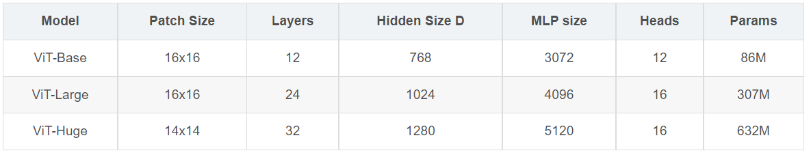
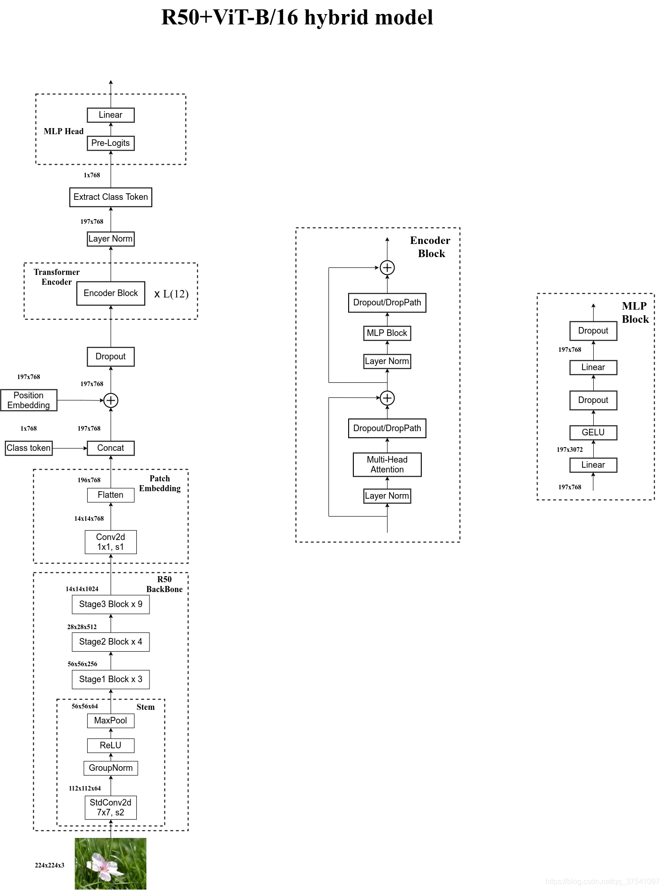
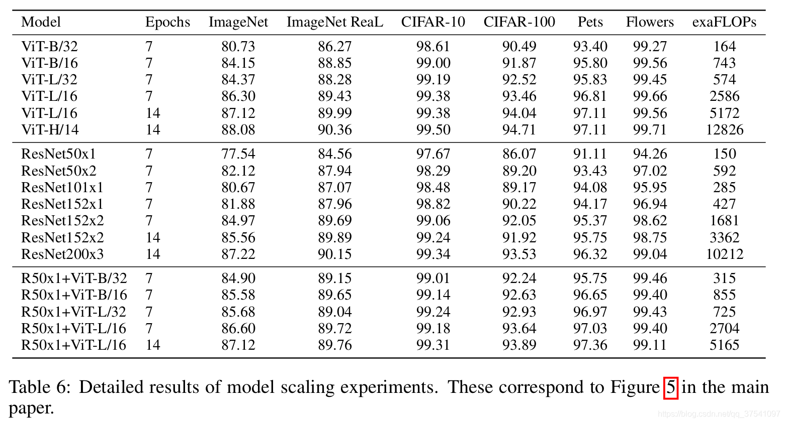

论文名称: [An Image Is Worth 16x16 Words: Transformers For Image Recognition At Scale](https://arxiv.org/abs/2010.11929)

论文源码：[论文源码](https://github.com/google-research/vision_transformer)    

# 模型

模型主要由三个模块组成：   
1. Linear Projection of  Flattened Patches(Embedding层，负责将图像转为token序列，以输入transformer encoder)
2. Transformer Encoder
3. MLP Head：用于分类

    
    

## Linear Projection of  Flattened Patches(Embedding层）

### Embeding

Embedding层负责将图像转为token序列，以输入transformer encoder。对于图像数据而言，其数据格式为[H, W, C]是三维矩阵明显不是Transformer想要的。所以需要先通过一个Embedding层来对数据做个变换。    

以ViT-B/16为例，步骤：   
1. 将输入图片(224x224)按照16x16大小的Patch进行划分，划分后会得到196个Patches；
2. 每个Patche数据shape为[16, 16, 3]通过线性映射得到一个长度为768的token。[16, 16, 3] -> [768]

以ViT-B/16为例，代码实现：   
1. 通过一个卷积层实现：kernel size：16×16，stride：16（因为patch大小是16*16，patch之间不相交），卷积核个数为768（16×16×3）的卷积来实现。通过卷积[224, 224, 3] -> [14, 14, 768]
2. 按照H、W两个维度展平（线性映射）：[14, 14, 768] -> [196, 768]

### class token、position embedding

    

class token（cat）：插入一个专门用于分类的[class]token，这个[class]token是一个可训练的参数，数据格式和其他token一样都是一个向量，以ViT-B/16为例，就是一个长度为768的向量，与之前从图片中生成的tokens拼接（cat）在一起，Cat([1, 768], [196, 768]) -> [197, 768]。    

position embedding（add）：采用的是一个可训练的参数（1D Pos. Emb.），是直接叠加在tokens上的（add），所以shape要一样。以ViT-B/16为例，刚刚拼接[class]token后shape是[197, 768]，那么这里的Position Embedding的shape也是[197, 768]。197 = cls_token(1) + patches(196)     

对于Position Embedding作者也有做一系列对比试验，在源码中默认使用的是1D Pos. Emb.，对比不使用Position Embedding准确率提升了大概3个点，和2D Pos. Emb.比起来没太大差别。

    

## Transformer Encoder

Transformer Encoder实际就是重复堆叠Encoder Block L次：   
    
主要由以下部分组成：    
1. Layer Norm
2. Multi-Head Attention
3. Dropout
4. MLP Block：全连接层（输入节点数翻4倍）+GELU激活函数+Dropout+全连接层（输入节点数缩小4倍）+Dropout    

首先通过Layer Norm生成Q、K、V三个向量，计算Q*K的时候即将两向量内积看做计算两个图片块(patch)的关联性，获得注意力权之后再scale到V，接着通过MLP层获得Encoder部分的输出(多头是为了让模型学习全方位、多层次、多角度的信息，学习到更为丰富的信息特征。例如，对于同一张图片来说，每个人看到的、注意到的部分都会存在一定的差异，而在图像中的多头恰恰是把这些差异综合起来让模型进行学习)   

## MLP Head

在之前进行Embedding的时候通过concat将用于分类的可学习向量(cls_token)嵌入到输入中，此时要将cls_token取出来输入到MLP Head中，即经过Layer Normal --> 全连接 --> GELU --> 全连接，得到了最终的输出。

## 模型参数

给出三个模型（Base/ Large/ Huge）的参数，在源码中除了有Patch Size为16x16的外还有32x32的。其中：   
1. Layers就是Transformer Encoder中重复堆叠Encoder Block的次数；
2. Hidden Size就是对应通过Embedding层后每个token的dim（向量的长度）；
3. MLP size是Transformer Encoder中MLP Block第一个全连接的节点个数（是Hidden Size的四倍）；
4. Heads代表Transformer中Multi-Head Attention的heads数。
    
    
    

# Hybrid模型

Hybrid模型就是将传统的CNN特征提取和Transformer进行结合。    
    
R50的卷积层采用的StdConv2d不是传统的Conv2d，然后将所有的BatchNorm层替换成GroupNorm层。在原Resnet50网络中，stage1重复堆叠3次，stage2重复堆叠4次，stage3重复堆叠6次，stage4重复堆叠3次，但在这里的R50中，把stage4中的3个Block移至stage3中，所以stage3中共重复堆叠9次。    

通过R50 Backbone进行特征提取后，得到的特征矩阵shape是[14, 14, 1024]，接着再输入Patch Embedding层，注意Patch Embedding中卷积层Conv2d的kernel_size和stride都变成了1，只是用来调整channel。    

对比ViT，Resnet以及Hybrid模型的效果。通过对比发现，在训练epoch较少时Hybrid优于ViT，但当epoch增大后ViT优于Hybrid。    

    

