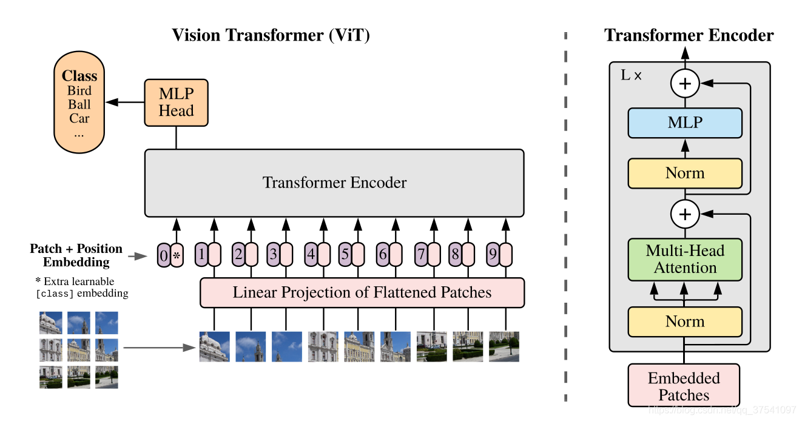
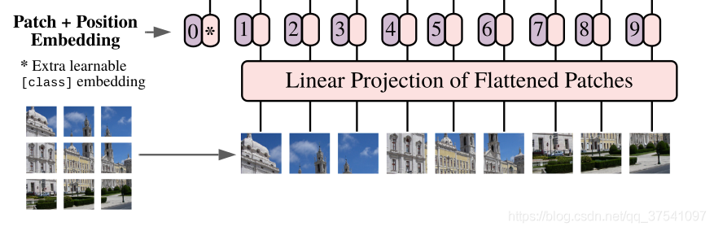
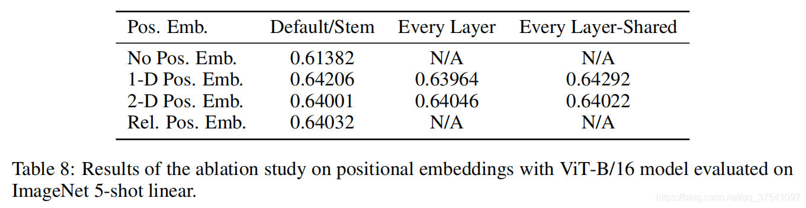

论文名称： An Image Is Worth 16x16 Words: Transformers For Image Recognition At Scale   
论文下载链接：https://arxiv.org/abs/2010.11929   
原论文对应源码：https://github.com/google-research/vision_transformer    

# 模型

模型主要由三个模块组成：   
1. Linear Projection of  Flattened Patches(Embedding层，负责将图像转为token序列，以输入transformer encoder)
2. Transformer Encoder
3. MLP Head：用于分类

    
    

## Linear Projection of  Flattened Patches(Embedding层）

### embeding

对于图像数据而言，其数据格式为[H, W, C]是三维矩阵明显不是Transformer想要的。所以需要先通过一个Embedding层来对数据做个变换。Embedding层负责将图像转为token序列，以输入transformer encoder。    

以ViT-B/16为例，步骤：   
1. 将输入图片(224x224)按照16x16大小的Patch进行划分，划分后会得到196个Patches；
2. 每个Patche数据shape为[16, 16, 3]通过线性映射得到一个长度为768的token。[16, 16, 3] -> [768]

以ViT-B/16为例，代码实现：   
1. 通过一个卷积层实现：kernel size：16×16，stride：16（因为patch大小是16*16，patch之间不相交），卷积核个数为768（16×16×3）的卷积来实现。通过卷积[224, 224, 3] -> [14, 14, 768]
2. 按照H、W两个维度展平（线性映射）：[14, 14, 768] -> [196, 768]

### class token、position embedding

    

class token（cat）：插入一个专门用于分类的[class]token，这个[class]token是一个可训练的参数，数据格式和其他token一样都是一个向量，以ViT-B/16为例，就是一个长度为768的向量，与之前从图片中生成的tokens拼接（cat）在一起，Cat([1, 768], [196, 768]) -> [197, 768]。    

position embedding（add）：采用的是一个可训练的参数（1D Pos. Emb.），是直接叠加在tokens上的（add），所以shape要一样。以ViT-B/16为例，刚刚拼接[class]token后shape是[197, 768]，那么这里的Position Embedding的shape也是[197, 768]。    

对于Position Embedding作者也有做一系列对比试验，在源码中默认使用的是1D Pos. Emb.，对比不使用Position Embedding准确率提升了大概3个点，和2D Pos. Emb.比起来没太大差别。

    

## Transformer Encoder

Transformer Encoder实际就是重复堆叠Encoder Block L次：   
    
