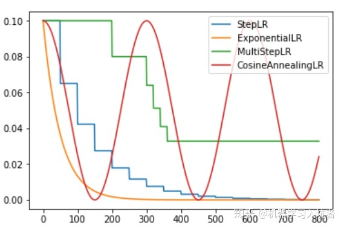
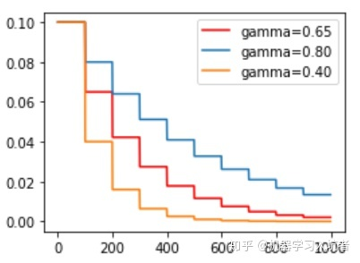
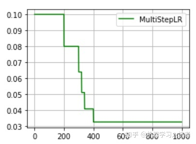

# 学习率衰减策略

梯度下降算法需要我们指定一个学习率作为权重更新步幅的控制因子，常用的学习率有0.01、0.001以及0.0001等，学习率越大则权重更新越快。一般来说，我们希望`在训练初期学习率大一些，使得网络收敛迅速`，`在训练后期学习率小一些，使得网络更好的收敛到最优解`。  
  

衰减类型：指数衰减、固定步长的衰减、多步长衰、余弦退火衰减。

## 指数衰减

```python
optimizer_ExpLR = torch.optim.SGD(net.parameters(), lr=0.1)
ExpLR = torch.optim.lr_scheduler.ExponentialLR(optimizer_ExpLR, gamma=0.98)
```

其中参数gamma表示衰减的底数，选择不同的gamma值可以获得幅度不同的衰减曲线，如下：  

  

## 固定步长衰减

有时我们希望学习率`每隔一定步数（或者epoch）就减少为原来的gamma分之一`，使用固定步长衰减依旧先定义优化器，再给优化器绑定StepLR对象：  

```python
optimizer_StepLR = torch.optim.SGD(net.parameters(), lr=0.1)
StepLR = torch.optim.lr_scheduler.StepLR(optimizer_StepLR, step_size=step_size, gamma=0.65)
```

其中gamma参数表示衰减的程度，step_size参数表示每隔多少个step进行一次学习率调整：  

  

## 多步长衰减

有时我们希望不同的区间采用不同的更新频率，或者是有的区间更新学习率，有的区间不更新学习率，这就需要使用MultiStepLR来实现动态区间长度控制：  

```python
optimizer_MultiStepLR = torch.optim.SGD(net.parameters(), lr=0.1)
torch.optim.lr_scheduler.MultiStepLR(optimizer_MultiStepLR, milestones=[200, 300, 320, 340, 200], gamma=0.8)
```

其中milestones参数为表示学习率更新的起止区间，在区间[0. 200]内学习率不更新，而在[200, 300]、[300, 320].....[340, 400]的右侧值都进行一次更新；gamma参数表示学习率衰减为上次的gamma分之一。其图示如下：  

  

在milestones以外的区间学习率始终保持不变。

## 余弦退火衰减

余弦退火策略不应该算是学习率衰减策略，因为它使得学习率按照周期变化，其定义方式如下：  

```python
optimizer_CosineLR = torch.optim.SGD(net.parameters(), lr=0.1)
CosineLR = torch.optim.lr_scheduler.CosineAnnealingLR(optimizer_CosineLR, T_max=150, eta_min=0)
```
参数T_max表示余弦函数周期；eta_min表示学习率的最小值，默认它是0表示学习率至少为正值。  

  
