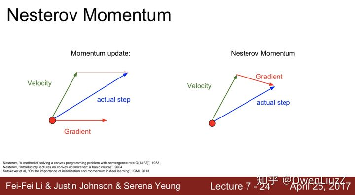
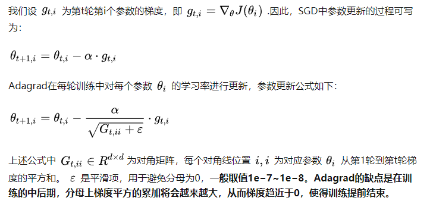
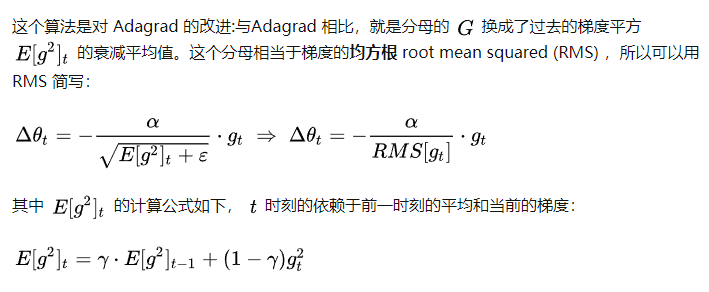
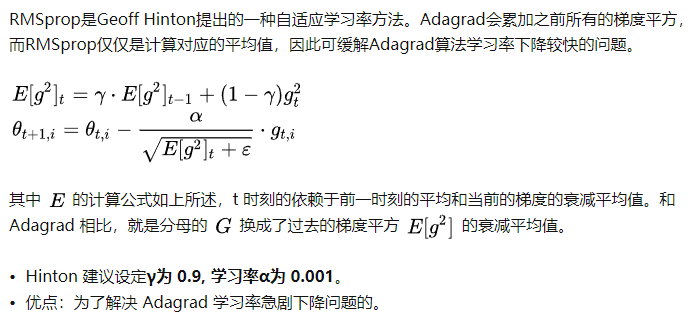
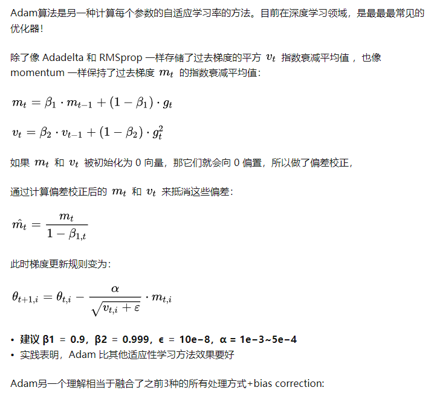
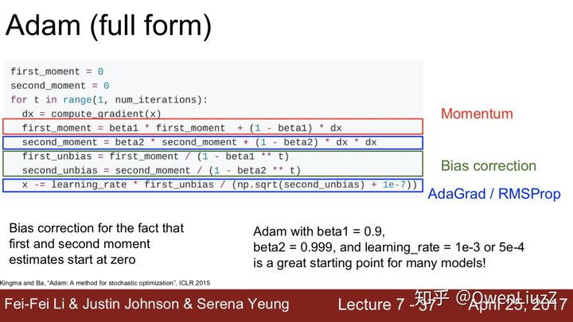

# 深度学习中额优化器optimizer

## BGD、SGD、MBGD

这三种形式的区别就是取决于我们用多少数据来计算目标函数的梯度，这样的话自然就涉及到一个 trade-off，即参数更新的准确率和运行时间。

### BGD batch gradient descent

BGD 采用整个训练集的数据计算损失函数对参数的梯度：  

缺点：  
- 在一次更新中，就对整个数据集计算梯度，所以计算起来非常慢
- 对于凸函数可以收敛到全局极小值(global point)，对于非凸函数可以收敛到局部极小值（local mini point)

### SGD stochastic gradient descent

和BGD算法相反，Stochastic gradient descent 算法每读入一个数据(每一个example)，便立刻计算损失函数的梯度来更新参数：  
  

优点：  
- 算法收敛速度快(在Batch Gradient Descent算法中, 每轮会计算很多相似样本的梯度, 这部分是冗余的)
- 有几率跳出一个比较差的局部最优而收敛到一个更好的局部最优甚至是全局最优  

缺点：
- 容易收敛到局部最优，并且容易被困在鞍点（saddle point）
- 更新比较频繁，会造成 cost function 有严重的震荡
- SGD对噪声比较敏感（单个example可能含有noise）
- SGD在高维中若一个Dimension的Gradient大，而另一个小，则会导致震荡，收敛速度变慢。

### MBGD Mini-batch Gradient Descent

MBGD 每一次利用一小批样本（batch），即 n 个样本进行计算(hyperparameter取值一般50～200)， 这样它可以降低参数更新时的方差，收敛更稳定， 另一方面可以充分地利用深度学习库中高度优化的矩阵操作来进行更有效的梯度计算。和 SGD 的区别是每一次循环不是作用于每个样本，而是具有 n 个样本的Batch。  
  

折中

## Momentum & Nesterov Momentum

### Momentum

Momentum算法借用了物理中的动量概念，它模拟的是物体运动时的惯性，即更新的时候在一定程度上保留之前更新的方向，同时利用当前batch的梯度微调最终的更新方向。这样一来，可以在一定程度上增加稳定性，从而学习地更快，并且还有一定摆脱局部最优的能力：

  
  

Momentum算法会观察历史梯度，若当前梯度的方向与历史梯度一致（表明当前样本不太可能为异常点），则会增强这个方向的梯度，若当前梯度与历史梯方向不一致，则梯度会衰减。一种形象的解释是：我们把一个球推下山，球在下坡时积聚动量，在途中变得越来越快，γ可视为空气阻力(hyperparameter一般取0.9 左右)，若球的方向发生变化，则动量会衰减。

### Nesterov Momentum

在小球向下滚动的过程中，我们希望小球能够提前知道在哪些地方坡面会上升，这样在遇到上升坡面之前，小球就开始减速。这方法就是Nesterov Momentum，其在凸优化中有较强的理论保证收敛。并且，在实践中Nesterov Momentum也比单纯的 Momentum 的效果好：

  
  

其核心思想是：注意到 momentum 方法，如果只看 γ * v 项，那么当前的 θ 经过 momentum 的作用会变成 θ + γ * v。因此可以把 θ + γ * v 这个位置看做是当前优化的一个”展望”位置。所以，可以在 θ + γ * v 求导, 而不是原始的 θ 。  

  

Nesterov Momentum 可以使 RNN 在很多任务上有更好的表现

## AdaGrad & Adadelta

### AdaGrad

上述所有方法中，对于每一个参数 θi 的训练都使用了相同的学习率 α 。Adagrad算法能够在训练中自动的对learning rate进行调整，`对于出现频率较低参数采用较大的α更新`；相反，`对于出现频率较高的参数采用较小的α更新`。因此，`Adagrad非常适合处理稀疏数据`。  

  

AdaGrad的缺点是在训练的中后期，分母上梯度平方的累加会越来越大，从而梯度趋近于0，使得训练提前结束。

### AdaDelta

  

### RMSprop

  

### Adam

  
  

怎么选择：  
- 如果数据是稀疏的，就用自适应方法：Adagrad，Adadelta，RMSprop，Adam
- RMSprop, Adadelta, Adam 在很多情况下的效果是相似的
- Adam 就是在 RMSprop 的基础上加了 bias-correction 和 momentum
- 随着梯度变的稀疏，Adam 比 RMSprop 效果会好
- 整体来讲，Adam 是最好的选择
  

